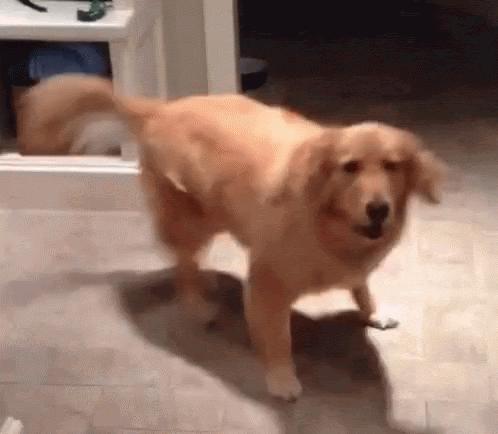

# Obrigado! ❤️🙌

<table>
<tr>
    <td>
        Sou verdadeiramente grato a todas as pessoas maravilhosas e empresas que apoiam no <a href="https://www.catarse.me/osib">Catarse</a> meu trabalho de código aberto.
    </td>
    <td align="center">
        
    </td>
    </tr>
</table>

---

🐲 Startup Dragão  <a href="https://www.catarse.me/pt/projects/151309/subscriptions/start?reward_id=267223" style="font-size: 12px">R$5000/mês</a>

- Sua/Seu logo/nome aqui
  

🦄 Startup Unicórnio <a href="https://www.catarse.me/pt/projects/151309/subscriptions/start?reward_id=267222" style="font-size: 12px">R$2500/mês</a>

- Sua/Seu logo/nome aqui

👔 ME <a href="https://www.catarse.me/pt/projects/151309/subscriptions/start?reward_id=267220" style="font-size: 12px">R$1000/mês</a>

- Sua/Seu logo/nome aqui

💻 Especialista <a href="https://www.catarse.me/pt/projects/151309/subscriptions/start?reward_id=267219" style="font-size: 12px">R$500/mês</a>

- Sua/Seu logo/nome aqui

💻 Senior <a href="https://www.catarse.me/pt/projects/151309/subscriptions/start?reward_id=267218" style="font-size: 12px">R$100/mês</a>

- Seu nome aqui

💻 Pleno <a href="https://www.catarse.me/pt/projects/151309/subscriptions/start?reward_id=267217" style="font-size: 12px">R$50/mês</a>

- Seu nome aqui

💻 Junior <a href="https://www.catarse.me/pt/projects/151309/subscriptions/start?reward_id=267216" style="font-size: 12px">R$10/mês</a>

- Seu nome aqui

💻 Estagiário <a href="https://www.catarse.me/pt/projects/151309/subscriptions/start?reward_id=267215" style="font-size: 12px">R$5/mês</a>

- Seu nome aqui

# Se torne um apoiador

Todo o material do bootcamp está disponível gratuitamente. Porém, esse projeto possui gastos. Caso você queira colaborar para que o mesmo continue existindo, eu te peço por favor que considere apoiá-lo. Decida quando gastar ou quanto gastar com base em seu próprio tempo e orçamento [clicando aqui](https://www.catarse.me/osib).

Obs: Caso deseje fazer uma doação única, [clique aqui](https://github.com/inkasadev/osib-frontend/blob/main/CONTRIBUTING.md).

# Apoiadores anteriores

Sou eternamente grato a essas pessoas e empresas que me apoiaram anteriormente.

---
<h5><i>Esta página é atualizada no primeiro dia de cada mês.</i></h5>